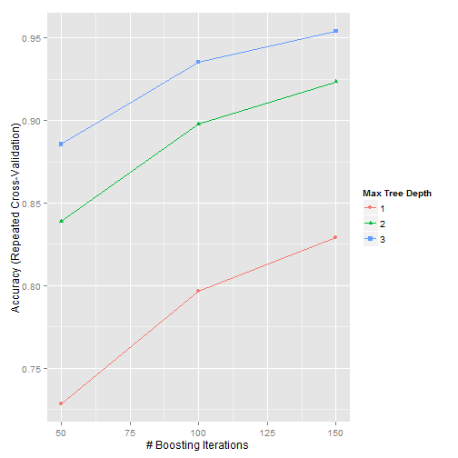
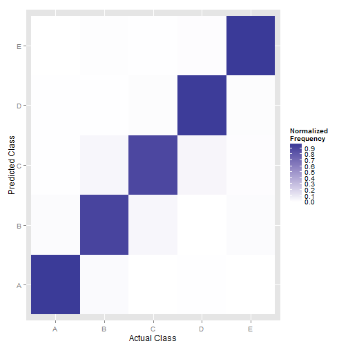

##Summary


Using devices such as Jawbone Up, Nike FuelBand, and Fitbit it is now possible to collect a large amount of data about personal activity relatively inexpensively. These type of devices are part of the quantified self movement – a group of enthusiasts who take measurements about themselves regularly to improve their health, to find patterns in their behavior, or because they are tech geeks. One thing that people regularly do is quantify how much of a particular activity they do, but they rarely quantify how well they do it. In this project, your goal will be to use data from accelerometers on the belt, forearm, arm, and dumbell of 6 participants. They were asked to perform barbell lifts correctly and incorrectly in 5 different ways. More information is available from the website [here](http://groupware.les.inf.puc-rio.br/har) (see the section on the Weight Lifting Exercise Dataset).
The goal of this report is to predict the manner in which they did the exercise.


##Exploring the Dataset

First of all, let's read and take a look at the dataset.


```r
raw_data <- read.csv("pml-training.csv")

dim(raw_data)
```

```
## [1] 19622   160
```

```r
summary(raw_data[, 1:10])
```

```
##        X            user_name    raw_timestamp_part_1 raw_timestamp_part_2
##  Min.   :    1   adelmo  :3892   Min.   :1.322e+09    Min.   :   294      
##  1st Qu.: 4906   carlitos:3112   1st Qu.:1.323e+09    1st Qu.:252912      
##  Median : 9812   charles :3536   Median :1.323e+09    Median :496380      
##  Mean   : 9812   eurico  :3070   Mean   :1.323e+09    Mean   :500656      
##  3rd Qu.:14717   jeremy  :3402   3rd Qu.:1.323e+09    3rd Qu.:751891      
##  Max.   :19622   pedro   :2610   Max.   :1.323e+09    Max.   :998801      
##                                                                           
##           cvtd_timestamp  new_window    num_window      roll_belt     
##  28/11/2011 14:14: 1498   no :19216   Min.   :  1.0   Min.   :-28.90  
##  05/12/2011 11:24: 1497   yes:  406   1st Qu.:222.0   1st Qu.:  1.10  
##  30/11/2011 17:11: 1440               Median :424.0   Median :113.00  
##  05/12/2011 11:25: 1425               Mean   :430.6   Mean   : 64.41  
##  02/12/2011 14:57: 1380               3rd Qu.:644.0   3rd Qu.:123.00  
##  02/12/2011 13:34: 1375               Max.   :864.0   Max.   :162.00  
##  (Other)         :11007                                               
##    pitch_belt          yaw_belt      
##  Min.   :-55.8000   Min.   :-180.00  
##  1st Qu.:  1.7600   1st Qu.: -88.30  
##  Median :  5.2800   Median : -13.00  
##  Mean   :  0.3053   Mean   : -11.21  
##  3rd Qu.: 14.9000   3rd Qu.:  12.90  
##  Max.   : 60.3000   Max.   : 179.00  
## 
```

```r
str(raw_data[, 1:10])
```

```
## 'data.frame':	19622 obs. of  10 variables:
##  $ X                   : int  1 2 3 4 5 6 7 8 9 10 ...
##  $ user_name           : Factor w/ 6 levels "adelmo","carlitos",..: 2 2 2 2 2 2 2 2 2 2 ...
##  $ raw_timestamp_part_1: int  1323084231 1323084231 1323084231 1323084232 1323084232 1323084232 1323084232 1323084232 1323084232 1323084232 ...
##  $ raw_timestamp_part_2: int  788290 808298 820366 120339 196328 304277 368296 440390 484323 484434 ...
##  $ cvtd_timestamp      : Factor w/ 20 levels "02/12/2011 13:32",..: 9 9 9 9 9 9 9 9 9 9 ...
##  $ new_window          : Factor w/ 2 levels "no","yes": 1 1 1 1 1 1 1 1 1 1 ...
##  $ num_window          : int  11 11 11 12 12 12 12 12 12 12 ...
##  $ roll_belt           : num  1.41 1.41 1.42 1.48 1.48 1.45 1.42 1.42 1.43 1.45 ...
##  $ pitch_belt          : num  8.07 8.07 8.07 8.05 8.07 8.06 8.09 8.13 8.16 8.17 ...
##  $ yaw_belt            : num  -94.4 -94.4 -94.4 -94.4 -94.4 -94.4 -94.4 -94.4 -94.4 -94.4 ...
```

(see Appendix for more details)


Observations:

+ Our dataset has 160 variables.
+ There are many quantitative variables that the vast majority of their values are missing.
+ There are many qualitative variables that the vast majority of their values are missing.


### Remove Missing Values


We will find and remove all the variables that have more missing than non-missing values from the dataset.


```r
bad_quant <- which(apply(raw_data, 2, function(x) sum(is.na(x))>length(x)/2))
bad_qual <- which(apply(raw_data, 2, function(x) sum(x=="")>length(x)/2))

data_set <- subset(raw_data, select = -c(bad_quant,bad_qual))

dim(data_set )
```

```
## [1] 19622    60
```


So we managed to reduce the dimensions of the dataset from 160 to 60. 


### Remove Redundant Variables

Next, we will calculate the correlation matrix and then use `findCorrelation` from `Caret` library, to find the highly correlated variables.


```r
library(caret)

set.seed(111)
# Find qualitative vars
qual_vars <- sapply(data_set , is.factor)
# Calculate correlation matrix (exclude qualitative vars)
cor_matrix <- cor(data_set [,!qual_vars])
# Find attributes that are highly corrected (>0.75)
highly_cor <- findCorrelation(cor_matrix, cutoff=0.75)
```

Remove the 22 redundant variables that we found since they are almost similar to the rest ones.


```r
data_set  <- data_set [,-highly_cor]
```

### Remove Irrelevant Variables 

Finally we will remove the variables `X`, `user_name`, `raw_timestamp_part_1`, `raw_timestamp_part_2`, `new_window`, `num_window` since they are irrelevant with the raw measurements.


```r
data_set  <- data_set [,-c(1:6)]
```

So the **dependant viariable** will be the `classe` and the final features will be the following:


| No |     Feature      | No |     Feature     | No |      Feature      |
|:--:|:----------------|:----:|:-----------------|:----:|:-------------------|
| 1  |   pitch_belt    |  12  |    accel_arm_z    |  23  | total_accel_forearm |
| 2  |     yaw_belt     |  13  |   magnet_arm_x    |  24  |   gyros_forearm_x   |
| 3  | total_accel_belt |  14  |   magnet_arm_y    |  25  |   gyros_forearm_z   |
| 4  |   accel_belt_z   |  15  |   magnet_arm_z    |  26  |   accel_forearm_x   |
| 5  |  magnet_belt_x   |  16  |   roll_dumbbell   |  27  |   accel_forearm_y   |
| 6  |  magnet_belt_y   |  17  |   yaw_dumbbell    |  28  |   accel_forearm_z   |
| 7  |  magnet_belt_z   |  18  | magnet_dumbbell_x |  29  |  magnet_forearm_x   |
| 8  |     roll_arm     |  19  | magnet_dumbbell_y |  30  |  magnet_forearm_y   |
| 9  |     yaw_arm      |  20  | magnet_dumbbell_z |  31  |  magnet_forearm_z   |
| 10 | total_accel_arm  |  21  |   roll_forearm    |   |              |
| 11 |   accel_arm_x    |  22  |   pitch_forearm   |   |                |


Before we continue we will slice the train data into train and test datasets 
using `createDataPartition` function. Moreover since data are in ascending order with respect to the `classe` I will randomize them before the partition.


```r
# Setting seed in order to make results reproducable
set.seed(111)

data_set  <- data_set [sample(nrow(data_set )),]
# Put 75% of data into the train set and the rest into the test set 
ind_train <- createDataPartition(data_set $classe, p = 0.75, list = F)
train <- data_set [ind_train,]
test <- data_set [-ind_train,]
```

Now that our datasets are ready I will use the train data to train and tune our model and the test data as an out of sample dataset in order to test the final model.


## Model Fitting


### Train and Tune Model
It's time to fit a model to our train (`train`) data. 
We will use the **boosted tree model**, we are also going to use **10-fold cross-validation** to tune the parameters of the algorithm.


```r
library(gbm)

# Define the resampling method
fit_con <- trainControl(## 10-fold CV
                           method = "repeatedcv",
                           number = 10,
                           ## repeated ten times
                           repeats = 10)
# Train the train datasets
gbm_fit <- train(classe ~ ., data = train,
                 method = "gbm",
                 trControl = fit_con,
                 verbose = FALSE)
```


```
## Stochastic Gradient Boosting 
## 
## 14718 samples
##    31 predictor
##     5 classes: 'A', 'B', 'C', 'D', 'E' 
## 
## No pre-processing
## Resampling: Cross-Validated (10 fold, repeated 10 times) 
## Summary of sample sizes: 13246, 13248, 13245, 13247, 13246, 13246, ... 
## Resampling results across tuning parameters:
## 
##   interaction.depth  n.trees  Accuracy   Kappa      Accuracy SD
##   1                   50      0.7286520  0.6560711  0.010344887
##   1                  100      0.7967451  0.7429981  0.009202689
##   1                  150      0.8291475  0.7840185  0.008967779
##   2                   50      0.8389048  0.7960873  0.009484612
##   2                  100      0.8977374  0.8705952  0.007380820
##   2                  150      0.9234609  0.9031513  0.005896950
##   3                   50      0.8855694  0.8551606  0.007975765
##   3                  100      0.9351747  0.9179580  0.005615171
##   3                  150      0.9538458  0.9416021  0.005075790
##   Kappa SD   
##   0.013097579
##   0.011630289
##   0.011313759
##   0.012009813
##   0.009332514
##   0.007460135
##   0.010103918
##   0.007114537
##   0.006423921
## 
## Tuning parameter 'shrinkage' was held constant at a value of 0.1
## 
## Tuning parameter 'n.minobsinnode' was held constant at a value of 10
## Accuracy was used to select the optimal model using  the largest value.
## The final values used for the model were n.trees = 150,
##  interaction.depth = 3, shrinkage = 0.1 and n.minobsinnode = 10.
```


As we can see the value for the parameters that optimize `gbm` algorithm are:


1. number of iterations (`n.trees`) = 150
2. complexity of the tree (`interaction.depth`) = 3
3. learning rate: how quickly the algorithm adapts (`shrinkage`) = 3
4. the minimum number of training set samples in a node to commence splitting             (`n.minobsinnode`) = 10

The accuracy is estimated to 0.954%.

### Accuracy vs Boosting Iterations

We may now examine the relationship between the estimates of performance and the tuning parameters.  


```r
trellis.par.set(caretTheme())
ggplot(gbm_fit)
```

 


### Test the Final Model 


Next we will use the `test` as an *out of sample* dataset in order to test our fitted model and find out if the accuracy that we estimated is close to our results.


```r
pred <- predict(gbm_fit,test)
sum(pred==test$classe)/length(test$classe)
```

```
## [1] 0.9482055
```

The accuracy for the test set is 0.9482% that is 1.11 times the standard deviation of the accuracy which is rather close.

### Examine Confusion Matrix

Finally we will use `confusionMatrix` function to examine the predictions.


```r
# Find the confusion matrix
conf_matrix <- confusionMatrix(pred,test$classe)
# Normilize the confusion matrix
norm_matrix <- apply(conf_matrix$table,1,function(x) x/sum(x))
# Convert to data frame
confusion <- as.data.frame(as.table(norm_matrix))
# Plot 
plot <- ggplot(confusion) + 
        geom_tile(aes(x=Reference, y=Prediction, fill = Freq)) + 
        scale_x_discrete(name="Actual Class") + 
        scale_y_discrete(name="Predicted Class") + 
        scale_fill_gradient2(breaks=seq(from=-0.5, to=4, by=.1)) + 
        labs(fill="Normalized\nFrequency")
print(plot)
```

 

___

\newpage


## Appendix


```r
str(raw_data)
```

```
## 'data.frame':	19622 obs. of  160 variables:
##  $ X                       : int  1 2 3 4 5 6 7 8 9 10 ...
##  $ user_name               : Factor w/ 6 levels "adelmo","carlitos",..: 2 2 2 2 2 2 2 2 2 2 ...
##  $ raw_timestamp_part_1    : int  1323084231 1323084231 1323084231 1323084232 1323084232 1323084232 1323084232 1323084232 1323084232 1323084232 ...
##  $ raw_timestamp_part_2    : int  788290 808298 820366 120339 196328 304277 368296 440390 484323 484434 ...
##  $ cvtd_timestamp          : Factor w/ 20 levels "02/12/2011 13:32",..: 9 9 9 9 9 9 9 9 9 9 ...
##  $ new_window              : Factor w/ 2 levels "no","yes": 1 1 1 1 1 1 1 1 1 1 ...
##  $ num_window              : int  11 11 11 12 12 12 12 12 12 12 ...
##  $ roll_belt               : num  1.41 1.41 1.42 1.48 1.48 1.45 1.42 1.42 1.43 1.45 ...
##  $ pitch_belt              : num  8.07 8.07 8.07 8.05 8.07 8.06 8.09 8.13 8.16 8.17 ...
##  $ yaw_belt                : num  -94.4 -94.4 -94.4 -94.4 -94.4 -94.4 -94.4 -94.4 -94.4 -94.4 ...
##  $ total_accel_belt        : int  3 3 3 3 3 3 3 3 3 3 ...
##  $ kurtosis_roll_belt      : Factor w/ 397 levels "","-0.016850",..: 1 1 1 1 1 1 1 1 1 1 ...
##  $ kurtosis_picth_belt     : Factor w/ 317 levels "","-0.021887",..: 1 1 1 1 1 1 1 1 1 1 ...
##  $ kurtosis_yaw_belt       : Factor w/ 2 levels "","#DIV/0!": 1 1 1 1 1 1 1 1 1 1 ...
##  $ skewness_roll_belt      : Factor w/ 395 levels "","-0.003095",..: 1 1 1 1 1 1 1 1 1 1 ...
##  $ skewness_roll_belt.1    : Factor w/ 338 levels "","-0.005928",..: 1 1 1 1 1 1 1 1 1 1 ...
##  $ skewness_yaw_belt       : Factor w/ 2 levels "","#DIV/0!": 1 1 1 1 1 1 1 1 1 1 ...
##  $ max_roll_belt           : num  NA NA NA NA NA NA NA NA NA NA ...
##  $ max_picth_belt          : int  NA NA NA NA NA NA NA NA NA NA ...
##  $ max_yaw_belt            : Factor w/ 68 levels "","-0.1","-0.2",..: 1 1 1 1 1 1 1 1 1 1 ...
##  $ min_roll_belt           : num  NA NA NA NA NA NA NA NA NA NA ...
##  $ min_pitch_belt          : int  NA NA NA NA NA NA NA NA NA NA ...
##  $ min_yaw_belt            : Factor w/ 68 levels "","-0.1","-0.2",..: 1 1 1 1 1 1 1 1 1 1 ...
##  $ amplitude_roll_belt     : num  NA NA NA NA NA NA NA NA NA NA ...
##  $ amplitude_pitch_belt    : int  NA NA NA NA NA NA NA NA NA NA ...
##  $ amplitude_yaw_belt      : Factor w/ 4 levels "","#DIV/0!","0.00",..: 1 1 1 1 1 1 1 1 1 1 ...
##  $ var_total_accel_belt    : num  NA NA NA NA NA NA NA NA NA NA ...
##  $ avg_roll_belt           : num  NA NA NA NA NA NA NA NA NA NA ...
##  $ stddev_roll_belt        : num  NA NA NA NA NA NA NA NA NA NA ...
##  $ var_roll_belt           : num  NA NA NA NA NA NA NA NA NA NA ...
##  $ avg_pitch_belt          : num  NA NA NA NA NA NA NA NA NA NA ...
##  $ stddev_pitch_belt       : num  NA NA NA NA NA NA NA NA NA NA ...
##  $ var_pitch_belt          : num  NA NA NA NA NA NA NA NA NA NA ...
##  $ avg_yaw_belt            : num  NA NA NA NA NA NA NA NA NA NA ...
##  $ stddev_yaw_belt         : num  NA NA NA NA NA NA NA NA NA NA ...
##  $ var_yaw_belt            : num  NA NA NA NA NA NA NA NA NA NA ...
##  $ gyros_belt_x            : num  0 0.02 0 0.02 0.02 0.02 0.02 0.02 0.02 0.03 ...
##  $ gyros_belt_y            : num  0 0 0 0 0.02 0 0 0 0 0 ...
##  $ gyros_belt_z            : num  -0.02 -0.02 -0.02 -0.03 -0.02 -0.02 -0.02 -0.02 -0.02 0 ...
##  $ accel_belt_x            : int  -21 -22 -20 -22 -21 -21 -22 -22 -20 -21 ...
##  $ accel_belt_y            : int  4 4 5 3 2 4 3 4 2 4 ...
##  $ accel_belt_z            : int  22 22 23 21 24 21 21 21 24 22 ...
##  $ magnet_belt_x           : int  -3 -7 -2 -6 -6 0 -4 -2 1 -3 ...
##  $ magnet_belt_y           : int  599 608 600 604 600 603 599 603 602 609 ...
##  $ magnet_belt_z           : int  -313 -311 -305 -310 -302 -312 -311 -313 -312 -308 ...
##  $ roll_arm                : num  -128 -128 -128 -128 -128 -128 -128 -128 -128 -128 ...
##  $ pitch_arm               : num  22.5 22.5 22.5 22.1 22.1 22 21.9 21.8 21.7 21.6 ...
##  $ yaw_arm                 : num  -161 -161 -161 -161 -161 -161 -161 -161 -161 -161 ...
##  $ total_accel_arm         : int  34 34 34 34 34 34 34 34 34 34 ...
##  $ var_accel_arm           : num  NA NA NA NA NA NA NA NA NA NA ...
##  $ avg_roll_arm            : num  NA NA NA NA NA NA NA NA NA NA ...
##  $ stddev_roll_arm         : num  NA NA NA NA NA NA NA NA NA NA ...
##  $ var_roll_arm            : num  NA NA NA NA NA NA NA NA NA NA ...
##  $ avg_pitch_arm           : num  NA NA NA NA NA NA NA NA NA NA ...
##  $ stddev_pitch_arm        : num  NA NA NA NA NA NA NA NA NA NA ...
##  $ var_pitch_arm           : num  NA NA NA NA NA NA NA NA NA NA ...
##  $ avg_yaw_arm             : num  NA NA NA NA NA NA NA NA NA NA ...
##  $ stddev_yaw_arm          : num  NA NA NA NA NA NA NA NA NA NA ...
##  $ var_yaw_arm             : num  NA NA NA NA NA NA NA NA NA NA ...
##  $ gyros_arm_x             : num  0 0.02 0.02 0.02 0 0.02 0 0.02 0.02 0.02 ...
##  $ gyros_arm_y             : num  0 -0.02 -0.02 -0.03 -0.03 -0.03 -0.03 -0.02 -0.03 -0.03 ...
##  $ gyros_arm_z             : num  -0.02 -0.02 -0.02 0.02 0 0 0 0 -0.02 -0.02 ...
##  $ accel_arm_x             : int  -288 -290 -289 -289 -289 -289 -289 -289 -288 -288 ...
##  $ accel_arm_y             : int  109 110 110 111 111 111 111 111 109 110 ...
##  $ accel_arm_z             : int  -123 -125 -126 -123 -123 -122 -125 -124 -122 -124 ...
##  $ magnet_arm_x            : int  -368 -369 -368 -372 -374 -369 -373 -372 -369 -376 ...
##  $ magnet_arm_y            : int  337 337 344 344 337 342 336 338 341 334 ...
##  $ magnet_arm_z            : int  516 513 513 512 506 513 509 510 518 516 ...
##  $ kurtosis_roll_arm       : Factor w/ 330 levels "","-0.02438",..: 1 1 1 1 1 1 1 1 1 1 ...
##  $ kurtosis_picth_arm      : Factor w/ 328 levels "","-0.00484",..: 1 1 1 1 1 1 1 1 1 1 ...
##  $ kurtosis_yaw_arm        : Factor w/ 395 levels "","-0.01548",..: 1 1 1 1 1 1 1 1 1 1 ...
##  $ skewness_roll_arm       : Factor w/ 331 levels "","-0.00051",..: 1 1 1 1 1 1 1 1 1 1 ...
##  $ skewness_pitch_arm      : Factor w/ 328 levels "","-0.00184",..: 1 1 1 1 1 1 1 1 1 1 ...
##  $ skewness_yaw_arm        : Factor w/ 395 levels "","-0.00311",..: 1 1 1 1 1 1 1 1 1 1 ...
##  $ max_roll_arm            : num  NA NA NA NA NA NA NA NA NA NA ...
##  $ max_picth_arm           : num  NA NA NA NA NA NA NA NA NA NA ...
##  $ max_yaw_arm             : int  NA NA NA NA NA NA NA NA NA NA ...
##  $ min_roll_arm            : num  NA NA NA NA NA NA NA NA NA NA ...
##  $ min_pitch_arm           : num  NA NA NA NA NA NA NA NA NA NA ...
##  $ min_yaw_arm             : int  NA NA NA NA NA NA NA NA NA NA ...
##  $ amplitude_roll_arm      : num  NA NA NA NA NA NA NA NA NA NA ...
##  $ amplitude_pitch_arm     : num  NA NA NA NA NA NA NA NA NA NA ...
##  $ amplitude_yaw_arm       : int  NA NA NA NA NA NA NA NA NA NA ...
##  $ roll_dumbbell           : num  13.1 13.1 12.9 13.4 13.4 ...
##  $ pitch_dumbbell          : num  -70.5 -70.6 -70.3 -70.4 -70.4 ...
##  $ yaw_dumbbell            : num  -84.9 -84.7 -85.1 -84.9 -84.9 ...
##  $ kurtosis_roll_dumbbell  : Factor w/ 398 levels "","-0.0035","-0.0073",..: 1 1 1 1 1 1 1 1 1 1 ...
##  $ kurtosis_picth_dumbbell : Factor w/ 401 levels "","-0.0163","-0.0233",..: 1 1 1 1 1 1 1 1 1 1 ...
##  $ kurtosis_yaw_dumbbell   : Factor w/ 2 levels "","#DIV/0!": 1 1 1 1 1 1 1 1 1 1 ...
##  $ skewness_roll_dumbbell  : Factor w/ 401 levels "","-0.0082","-0.0096",..: 1 1 1 1 1 1 1 1 1 1 ...
##  $ skewness_pitch_dumbbell : Factor w/ 402 levels "","-0.0053","-0.0084",..: 1 1 1 1 1 1 1 1 1 1 ...
##  $ skewness_yaw_dumbbell   : Factor w/ 2 levels "","#DIV/0!": 1 1 1 1 1 1 1 1 1 1 ...
##  $ max_roll_dumbbell       : num  NA NA NA NA NA NA NA NA NA NA ...
##  $ max_picth_dumbbell      : num  NA NA NA NA NA NA NA NA NA NA ...
##  $ max_yaw_dumbbell        : Factor w/ 73 levels "","-0.1","-0.2",..: 1 1 1 1 1 1 1 1 1 1 ...
##  $ min_roll_dumbbell       : num  NA NA NA NA NA NA NA NA NA NA ...
##  $ min_pitch_dumbbell      : num  NA NA NA NA NA NA NA NA NA NA ...
##  $ min_yaw_dumbbell        : Factor w/ 73 levels "","-0.1","-0.2",..: 1 1 1 1 1 1 1 1 1 1 ...
##  $ amplitude_roll_dumbbell : num  NA NA NA NA NA NA NA NA NA NA ...
##   [list output truncated]
```

```r
summary(raw_data)
```

```
##        X            user_name    raw_timestamp_part_1 raw_timestamp_part_2
##  Min.   :    1   adelmo  :3892   Min.   :1.322e+09    Min.   :   294      
##  1st Qu.: 4906   carlitos:3112   1st Qu.:1.323e+09    1st Qu.:252912      
##  Median : 9812   charles :3536   Median :1.323e+09    Median :496380      
##  Mean   : 9812   eurico  :3070   Mean   :1.323e+09    Mean   :500656      
##  3rd Qu.:14717   jeremy  :3402   3rd Qu.:1.323e+09    3rd Qu.:751891      
##  Max.   :19622   pedro   :2610   Max.   :1.323e+09    Max.   :998801      
##                                                                           
##           cvtd_timestamp  new_window    num_window      roll_belt     
##  28/11/2011 14:14: 1498   no :19216   Min.   :  1.0   Min.   :-28.90  
##  05/12/2011 11:24: 1497   yes:  406   1st Qu.:222.0   1st Qu.:  1.10  
##  30/11/2011 17:11: 1440               Median :424.0   Median :113.00  
##  05/12/2011 11:25: 1425               Mean   :430.6   Mean   : 64.41  
##  02/12/2011 14:57: 1380               3rd Qu.:644.0   3rd Qu.:123.00  
##  02/12/2011 13:34: 1375               Max.   :864.0   Max.   :162.00  
##  (Other)         :11007                                               
##    pitch_belt          yaw_belt       total_accel_belt kurtosis_roll_belt
##  Min.   :-55.8000   Min.   :-180.00   Min.   : 0.00             :19216   
##  1st Qu.:  1.7600   1st Qu.: -88.30   1st Qu.: 3.00    #DIV/0!  :   10   
##  Median :  5.2800   Median : -13.00   Median :17.00    -1.908453:    2   
##  Mean   :  0.3053   Mean   : -11.21   Mean   :11.31    -0.016850:    1   
##  3rd Qu.: 14.9000   3rd Qu.:  12.90   3rd Qu.:18.00    -0.021024:    1   
##  Max.   : 60.3000   Max.   : 179.00   Max.   :29.00    -0.025513:    1   
##                                                        (Other)  :  391   
##  kurtosis_picth_belt kurtosis_yaw_belt skewness_roll_belt
##           :19216            :19216              :19216   
##  #DIV/0!  :   32     #DIV/0!:  406     #DIV/0!  :    9   
##  47.000000:    4                       0.000000 :    4   
##  -0.150950:    3                       0.422463 :    2   
##  -0.684748:    3                       -0.003095:    1   
##  -1.750749:    3                       -0.010002:    1   
##  (Other)  :  361                       (Other)  :  389   
##  skewness_roll_belt.1 skewness_yaw_belt max_roll_belt     max_picth_belt 
##           :19216             :19216     Min.   :-94.300   Min.   : 3.00  
##  #DIV/0!  :   32      #DIV/0!:  406     1st Qu.:-88.000   1st Qu.: 5.00  
##  0.000000 :    4                        Median : -5.100   Median :18.00  
##  -2.156553:    3                        Mean   : -6.667   Mean   :12.92  
##  -3.072669:    3                        3rd Qu.: 18.500   3rd Qu.:19.00  
##  -6.324555:    3                        Max.   :180.000   Max.   :30.00  
##  (Other)  :  361                        NA's   :19216     NA's   :19216  
##   max_yaw_belt   min_roll_belt     min_pitch_belt   min_yaw_belt  
##         :19216   Min.   :-180.00   Min.   : 0.00          :19216  
##  -1.1   :   30   1st Qu.: -88.40   1st Qu.: 3.00   -1.1   :   30  
##  -1.4   :   29   Median :  -7.85   Median :16.00   -1.4   :   29  
##  -1.2   :   26   Mean   : -10.44   Mean   :10.76   -1.2   :   26  
##  -0.9   :   24   3rd Qu.:   9.05   3rd Qu.:17.00   -0.9   :   24  
##  -1.3   :   22   Max.   : 173.00   Max.   :23.00   -1.3   :   22  
##  (Other):  275   NA's   :19216     NA's   :19216   (Other):  275  
##  amplitude_roll_belt amplitude_pitch_belt amplitude_yaw_belt
##  Min.   :  0.000     Min.   : 0.000              :19216     
##  1st Qu.:  0.300     1st Qu.: 1.000       #DIV/0!:   10     
##  Median :  1.000     Median : 1.000       0.00   :   12     
##  Mean   :  3.769     Mean   : 2.167       0.0000 :  384     
##  3rd Qu.:  2.083     3rd Qu.: 2.000                         
##  Max.   :360.000     Max.   :12.000                         
##  NA's   :19216       NA's   :19216                          
##  var_total_accel_belt avg_roll_belt    stddev_roll_belt var_roll_belt    
##  Min.   : 0.000       Min.   :-27.40   Min.   : 0.000   Min.   :  0.000  
##  1st Qu.: 0.100       1st Qu.:  1.10   1st Qu.: 0.200   1st Qu.:  0.000  
##  Median : 0.200       Median :116.35   Median : 0.400   Median :  0.100  
##  Mean   : 0.926       Mean   : 68.06   Mean   : 1.337   Mean   :  7.699  
##  3rd Qu.: 0.300       3rd Qu.:123.38   3rd Qu.: 0.700   3rd Qu.:  0.500  
##  Max.   :16.500       Max.   :157.40   Max.   :14.200   Max.   :200.700  
##  NA's   :19216        NA's   :19216    NA's   :19216    NA's   :19216    
##  avg_pitch_belt    stddev_pitch_belt var_pitch_belt    avg_yaw_belt     
##  Min.   :-51.400   Min.   :0.000     Min.   : 0.000   Min.   :-138.300  
##  1st Qu.:  2.025   1st Qu.:0.200     1st Qu.: 0.000   1st Qu.: -88.175  
##  Median :  5.200   Median :0.400     Median : 0.100   Median :  -6.550  
##  Mean   :  0.520   Mean   :0.603     Mean   : 0.766   Mean   :  -8.831  
##  3rd Qu.: 15.775   3rd Qu.:0.700     3rd Qu.: 0.500   3rd Qu.:  14.125  
##  Max.   : 59.700   Max.   :4.000     Max.   :16.200   Max.   : 173.500  
##  NA's   :19216     NA's   :19216     NA's   :19216    NA's   :19216     
##  stddev_yaw_belt    var_yaw_belt        gyros_belt_x      
##  Min.   :  0.000   Min.   :    0.000   Min.   :-1.040000  
##  1st Qu.:  0.100   1st Qu.:    0.010   1st Qu.:-0.030000  
##  Median :  0.300   Median :    0.090   Median : 0.030000  
##  Mean   :  1.341   Mean   :  107.487   Mean   :-0.005592  
##  3rd Qu.:  0.700   3rd Qu.:    0.475   3rd Qu.: 0.110000  
##  Max.   :176.600   Max.   :31183.240   Max.   : 2.220000  
##  NA's   :19216     NA's   :19216                          
##   gyros_belt_y       gyros_belt_z      accel_belt_x       accel_belt_y   
##  Min.   :-0.64000   Min.   :-1.4600   Min.   :-120.000   Min.   :-69.00  
##  1st Qu.: 0.00000   1st Qu.:-0.2000   1st Qu.: -21.000   1st Qu.:  3.00  
##  Median : 0.02000   Median :-0.1000   Median : -15.000   Median : 35.00  
##  Mean   : 0.03959   Mean   :-0.1305   Mean   :  -5.595   Mean   : 30.15  
##  3rd Qu.: 0.11000   3rd Qu.:-0.0200   3rd Qu.:  -5.000   3rd Qu.: 61.00  
##  Max.   : 0.64000   Max.   : 1.6200   Max.   :  85.000   Max.   :164.00  
##                                                                          
##   accel_belt_z     magnet_belt_x   magnet_belt_y   magnet_belt_z   
##  Min.   :-275.00   Min.   :-52.0   Min.   :354.0   Min.   :-623.0  
##  1st Qu.:-162.00   1st Qu.:  9.0   1st Qu.:581.0   1st Qu.:-375.0  
##  Median :-152.00   Median : 35.0   Median :601.0   Median :-320.0  
##  Mean   : -72.59   Mean   : 55.6   Mean   :593.7   Mean   :-345.5  
##  3rd Qu.:  27.00   3rd Qu.: 59.0   3rd Qu.:610.0   3rd Qu.:-306.0  
##  Max.   : 105.00   Max.   :485.0   Max.   :673.0   Max.   : 293.0  
##                                                                    
##     roll_arm         pitch_arm          yaw_arm          total_accel_arm
##  Min.   :-180.00   Min.   :-88.800   Min.   :-180.0000   Min.   : 1.00  
##  1st Qu.: -31.77   1st Qu.:-25.900   1st Qu.: -43.1000   1st Qu.:17.00  
##  Median :   0.00   Median :  0.000   Median :   0.0000   Median :27.00  
##  Mean   :  17.83   Mean   : -4.612   Mean   :  -0.6188   Mean   :25.51  
##  3rd Qu.:  77.30   3rd Qu.: 11.200   3rd Qu.:  45.8750   3rd Qu.:33.00  
##  Max.   : 180.00   Max.   : 88.500   Max.   : 180.0000   Max.   :66.00  
##                                                                         
##  var_accel_arm     avg_roll_arm     stddev_roll_arm    var_roll_arm      
##  Min.   :  0.00   Min.   :-166.67   Min.   :  0.000   Min.   :    0.000  
##  1st Qu.:  9.03   1st Qu.: -38.37   1st Qu.:  1.376   1st Qu.:    1.898  
##  Median : 40.61   Median :   0.00   Median :  5.702   Median :   32.517  
##  Mean   : 53.23   Mean   :  12.68   Mean   : 11.201   Mean   :  417.264  
##  3rd Qu.: 75.62   3rd Qu.:  76.33   3rd Qu.: 14.921   3rd Qu.:  222.647  
##  Max.   :331.70   Max.   : 163.33   Max.   :161.964   Max.   :26232.208  
##  NA's   :19216    NA's   :19216     NA's   :19216     NA's   :19216      
##  avg_pitch_arm     stddev_pitch_arm var_pitch_arm       avg_yaw_arm      
##  Min.   :-81.773   Min.   : 0.000   Min.   :   0.000   Min.   :-173.440  
##  1st Qu.:-22.770   1st Qu.: 1.642   1st Qu.:   2.697   1st Qu.: -29.198  
##  Median :  0.000   Median : 8.133   Median :  66.146   Median :   0.000  
##  Mean   : -4.901   Mean   :10.383   Mean   : 195.864   Mean   :   2.359  
##  3rd Qu.:  8.277   3rd Qu.:16.327   3rd Qu.: 266.576   3rd Qu.:  38.185  
##  Max.   : 75.659   Max.   :43.412   Max.   :1884.565   Max.   : 152.000  
##  NA's   :19216     NA's   :19216    NA's   :19216      NA's   :19216     
##  stddev_yaw_arm     var_yaw_arm         gyros_arm_x      
##  Min.   :  0.000   Min.   :    0.000   Min.   :-6.37000  
##  1st Qu.:  2.577   1st Qu.:    6.642   1st Qu.:-1.33000  
##  Median : 16.682   Median :  278.309   Median : 0.08000  
##  Mean   : 22.270   Mean   : 1055.933   Mean   : 0.04277  
##  3rd Qu.: 35.984   3rd Qu.: 1294.850   3rd Qu.: 1.57000  
##  Max.   :177.044   Max.   :31344.568   Max.   : 4.87000  
##  NA's   :19216     NA's   :19216                         
##   gyros_arm_y       gyros_arm_z       accel_arm_x       accel_arm_y    
##  Min.   :-3.4400   Min.   :-2.3300   Min.   :-404.00   Min.   :-318.0  
##  1st Qu.:-0.8000   1st Qu.:-0.0700   1st Qu.:-242.00   1st Qu.: -54.0  
##  Median :-0.2400   Median : 0.2300   Median : -44.00   Median :  14.0  
##  Mean   :-0.2571   Mean   : 0.2695   Mean   : -60.24   Mean   :  32.6  
##  3rd Qu.: 0.1400   3rd Qu.: 0.7200   3rd Qu.:  84.00   3rd Qu.: 139.0  
##  Max.   : 2.8400   Max.   : 3.0200   Max.   : 437.00   Max.   : 308.0  
##                                                                        
##   accel_arm_z       magnet_arm_x     magnet_arm_y     magnet_arm_z   
##  Min.   :-636.00   Min.   :-584.0   Min.   :-392.0   Min.   :-597.0  
##  1st Qu.:-143.00   1st Qu.:-300.0   1st Qu.:  -9.0   1st Qu.: 131.2  
##  Median : -47.00   Median : 289.0   Median : 202.0   Median : 444.0  
##  Mean   : -71.25   Mean   : 191.7   Mean   : 156.6   Mean   : 306.5  
##  3rd Qu.:  23.00   3rd Qu.: 637.0   3rd Qu.: 323.0   3rd Qu.: 545.0  
##  Max.   : 292.00   Max.   : 782.0   Max.   : 583.0   Max.   : 694.0  
##                                                                      
##  kurtosis_roll_arm kurtosis_picth_arm kurtosis_yaw_arm skewness_roll_arm
##          :19216            :19216             :19216           :19216   
##  #DIV/0! :   78    #DIV/0! :   80     #DIV/0! :   11   #DIV/0! :   77   
##  -0.02438:    1    -0.00484:    1     0.55844 :    2   -0.00051:    1   
##  -0.04190:    1    -0.01311:    1     0.65132 :    2   -0.00696:    1   
##  -0.05051:    1    -0.02967:    1     -0.01548:    1   -0.01884:    1   
##  -0.05695:    1    -0.07394:    1     -0.01749:    1   -0.03359:    1   
##  (Other) :  324    (Other) :  322     (Other) :  389   (Other) :  325   
##  skewness_pitch_arm skewness_yaw_arm  max_roll_arm     max_picth_arm     
##          :19216             :19216   Min.   :-73.100   Min.   :-173.000  
##  #DIV/0! :   80     #DIV/0! :   11   1st Qu.: -0.175   1st Qu.:  -1.975  
##  -0.00184:    1     -1.62032:    2   Median :  4.950   Median :  23.250  
##  -0.01185:    1     0.55053 :    2   Mean   : 11.236   Mean   :  35.751  
##  -0.01247:    1     -0.00311:    1   3rd Qu.: 26.775   3rd Qu.:  95.975  
##  -0.02063:    1     -0.00562:    1   Max.   : 85.500   Max.   : 180.000  
##  (Other) :  322     (Other) :  389   NA's   :19216     NA's   :19216     
##   max_yaw_arm     min_roll_arm    min_pitch_arm      min_yaw_arm   
##  Min.   : 4.00   Min.   :-89.10   Min.   :-180.00   Min.   : 1.00  
##  1st Qu.:29.00   1st Qu.:-41.98   1st Qu.: -72.62   1st Qu.: 8.00  
##  Median :34.00   Median :-22.45   Median : -33.85   Median :13.00  
##  Mean   :35.46   Mean   :-21.22   Mean   : -33.92   Mean   :14.66  
##  3rd Qu.:41.00   3rd Qu.:  0.00   3rd Qu.:   0.00   3rd Qu.:19.00  
##  Max.   :65.00   Max.   : 66.40   Max.   : 152.00   Max.   :38.00  
##  NA's   :19216   NA's   :19216    NA's   :19216     NA's   :19216  
##  amplitude_roll_arm amplitude_pitch_arm amplitude_yaw_arm
##  Min.   :  0.000    Min.   :  0.000     Min.   : 0.00    
##  1st Qu.:  5.425    1st Qu.:  9.925     1st Qu.:13.00    
##  Median : 28.450    Median : 54.900     Median :22.00    
##  Mean   : 32.452    Mean   : 69.677     Mean   :20.79    
##  3rd Qu.: 50.960    3rd Qu.:115.175     3rd Qu.:28.75    
##  Max.   :119.500    Max.   :360.000     Max.   :52.00    
##  NA's   :19216      NA's   :19216       NA's   :19216    
##  roll_dumbbell     pitch_dumbbell     yaw_dumbbell     
##  Min.   :-153.71   Min.   :-149.59   Min.   :-150.871  
##  1st Qu.: -18.49   1st Qu.: -40.89   1st Qu.: -77.644  
##  Median :  48.17   Median : -20.96   Median :  -3.324  
##  Mean   :  23.84   Mean   : -10.78   Mean   :   1.674  
##  3rd Qu.:  67.61   3rd Qu.:  17.50   3rd Qu.:  79.643  
##  Max.   : 153.55   Max.   : 149.40   Max.   : 154.952  
##                                                        
##  kurtosis_roll_dumbbell kurtosis_picth_dumbbell kurtosis_yaw_dumbbell
##         :19216                 :19216                  :19216        
##  #DIV/0!:    5          -0.5464:    2           #DIV/0!:  406        
##  -0.2583:    2          -0.9334:    2                                
##  -0.3705:    2          -2.0833:    2                                
##  -0.5855:    2          -2.0851:    2                                
##  -2.0851:    2          -2.0889:    2                                
##  (Other):  393          (Other):  396                                
##  skewness_roll_dumbbell skewness_pitch_dumbbell skewness_yaw_dumbbell
##         :19216                 :19216                  :19216        
##  #DIV/0!:    4          -0.2328:    2           #DIV/0!:  406        
##  -0.9324:    2          -0.3521:    2                                
##  0.1110 :    2          -0.7036:    2                                
##  1.0312 :    2          0.1090 :    2                                
##  -0.0082:    1          1.0326 :    2                                
##  (Other):  395          (Other):  396                                
##  max_roll_dumbbell max_picth_dumbbell max_yaw_dumbbell min_roll_dumbbell
##  Min.   :-70.10    Min.   :-112.90           :19216    Min.   :-149.60  
##  1st Qu.:-27.15    1st Qu.: -66.70    -0.6   :   20    1st Qu.: -59.67  
##  Median : 14.85    Median :  40.05    0.2    :   19    Median : -43.55  
##  Mean   : 13.76    Mean   :  32.75    -0.8   :   18    Mean   : -41.24  
##  3rd Qu.: 50.58    3rd Qu.: 133.22    -0.3   :   16    3rd Qu.: -25.20  
##  Max.   :137.00    Max.   : 155.00    -0.2   :   15    Max.   :  73.20  
##  NA's   :19216     NA's   :19216      (Other):  318    NA's   :19216    
##  min_pitch_dumbbell min_yaw_dumbbell amplitude_roll_dumbbell
##  Min.   :-147.00           :19216    Min.   :  0.00         
##  1st Qu.: -91.80    -0.6   :   20    1st Qu.: 14.97         
##  Median : -66.15    0.2    :   19    Median : 35.05         
##  Mean   : -33.18    -0.8   :   18    Mean   : 55.00         
##  3rd Qu.:  21.20    -0.3   :   16    3rd Qu.: 81.04         
##  Max.   : 120.90    -0.2   :   15    Max.   :256.48         
##  NA's   :19216      (Other):  318    NA's   :19216          
##  amplitude_pitch_dumbbell amplitude_yaw_dumbbell total_accel_dumbbell
##  Min.   :  0.00                  :19216          Min.   : 0.00       
##  1st Qu.: 17.06           #DIV/0!:    5          1st Qu.: 4.00       
##  Median : 41.73           0.00   :  401          Median :10.00       
##  Mean   : 65.93                                  Mean   :13.72       
##  3rd Qu.: 99.55                                  3rd Qu.:19.00       
##  Max.   :273.59                                  Max.   :58.00       
##  NA's   :19216                                                       
##  var_accel_dumbbell avg_roll_dumbbell stddev_roll_dumbbell
##  Min.   :  0.000    Min.   :-128.96   Min.   :  0.000     
##  1st Qu.:  0.378    1st Qu.: -12.33   1st Qu.:  4.639     
##  Median :  1.000    Median :  48.23   Median : 12.204     
##  Mean   :  4.388    Mean   :  23.86   Mean   : 20.761     
##  3rd Qu.:  3.434    3rd Qu.:  64.37   3rd Qu.: 26.356     
##  Max.   :230.428    Max.   : 125.99   Max.   :123.778     
##  NA's   :19216      NA's   :19216     NA's   :19216       
##  var_roll_dumbbell  avg_pitch_dumbbell stddev_pitch_dumbbell
##  Min.   :    0.00   Min.   :-70.73     Min.   : 0.000       
##  1st Qu.:   21.52   1st Qu.:-42.00     1st Qu.: 3.482       
##  Median :  148.95   Median :-19.91     Median : 8.089       
##  Mean   : 1020.27   Mean   :-12.33     Mean   :13.147       
##  3rd Qu.:  694.65   3rd Qu.: 13.21     3rd Qu.:19.238       
##  Max.   :15321.01   Max.   : 94.28     Max.   :82.680       
##  NA's   :19216      NA's   :19216      NA's   :19216        
##  var_pitch_dumbbell avg_yaw_dumbbell   stddev_yaw_dumbbell
##  Min.   :   0.00    Min.   :-117.950   Min.   :  0.000    
##  1st Qu.:  12.12    1st Qu.: -76.696   1st Qu.:  3.885    
##  Median :  65.44    Median :  -4.505   Median : 10.264    
##  Mean   : 350.31    Mean   :   0.202   Mean   : 16.647    
##  3rd Qu.: 370.11    3rd Qu.:  71.234   3rd Qu.: 24.674    
##  Max.   :6836.02    Max.   : 134.905   Max.   :107.088    
##  NA's   :19216      NA's   :19216      NA's   :19216      
##  var_yaw_dumbbell   gyros_dumbbell_x    gyros_dumbbell_y  
##  Min.   :    0.00   Min.   :-204.0000   Min.   :-2.10000  
##  1st Qu.:   15.09   1st Qu.:  -0.0300   1st Qu.:-0.14000  
##  Median :  105.35   Median :   0.1300   Median : 0.03000  
##  Mean   :  589.84   Mean   :   0.1611   Mean   : 0.04606  
##  3rd Qu.:  608.79   3rd Qu.:   0.3500   3rd Qu.: 0.21000  
##  Max.   :11467.91   Max.   :   2.2200   Max.   :52.00000  
##  NA's   :19216                                            
##  gyros_dumbbell_z  accel_dumbbell_x  accel_dumbbell_y  accel_dumbbell_z 
##  Min.   : -2.380   Min.   :-419.00   Min.   :-189.00   Min.   :-334.00  
##  1st Qu.: -0.310   1st Qu.: -50.00   1st Qu.:  -8.00   1st Qu.:-142.00  
##  Median : -0.130   Median :  -8.00   Median :  41.50   Median :  -1.00  
##  Mean   : -0.129   Mean   : -28.62   Mean   :  52.63   Mean   : -38.32  
##  3rd Qu.:  0.030   3rd Qu.:  11.00   3rd Qu.: 111.00   3rd Qu.:  38.00  
##  Max.   :317.000   Max.   : 235.00   Max.   : 315.00   Max.   : 318.00  
##                                                                         
##  magnet_dumbbell_x magnet_dumbbell_y magnet_dumbbell_z  roll_forearm      
##  Min.   :-643.0    Min.   :-3600     Min.   :-262.00   Min.   :-180.0000  
##  1st Qu.:-535.0    1st Qu.:  231     1st Qu.: -45.00   1st Qu.:  -0.7375  
##  Median :-479.0    Median :  311     Median :  13.00   Median :  21.7000  
##  Mean   :-328.5    Mean   :  221     Mean   :  46.05   Mean   :  33.8265  
##  3rd Qu.:-304.0    3rd Qu.:  390     3rd Qu.:  95.00   3rd Qu.: 140.0000  
##  Max.   : 592.0    Max.   :  633     Max.   : 452.00   Max.   : 180.0000  
##                                                                           
##  pitch_forearm     yaw_forearm      kurtosis_roll_forearm
##  Min.   :-72.50   Min.   :-180.00          :19216        
##  1st Qu.:  0.00   1st Qu.: -68.60   #DIV/0!:   84        
##  Median :  9.24   Median :   0.00   -0.8079:    2        
##  Mean   : 10.71   Mean   :  19.21   -0.9169:    2        
##  3rd Qu.: 28.40   3rd Qu.: 110.00   -0.0227:    1        
##  Max.   : 89.80   Max.   : 180.00   -0.0359:    1        
##                                     (Other):  316        
##  kurtosis_picth_forearm kurtosis_yaw_forearm skewness_roll_forearm
##         :19216                 :19216               :19216        
##  #DIV/0!:   85          #DIV/0!:  406        #DIV/0!:   83        
##  -0.0073:    1                               -0.1912:    2        
##  -0.0442:    1                               -0.4126:    2        
##  -0.0489:    1                               -0.0004:    1        
##  -0.0523:    1                               -0.0013:    1        
##  (Other):  317                               (Other):  317        
##  skewness_pitch_forearm skewness_yaw_forearm max_roll_forearm
##         :19216                 :19216        Min.   :-66.60  
##  #DIV/0!:   85          #DIV/0!:  406        1st Qu.:  0.00  
##  0.0000 :    4                               Median : 26.80  
##  -0.6992:    2                               Mean   : 24.49  
##  -0.0113:    1                               3rd Qu.: 45.95  
##  -0.0131:    1                               Max.   : 89.80  
##  (Other):  313                               NA's   :19216   
##  max_picth_forearm max_yaw_forearm min_roll_forearm  min_pitch_forearm
##  Min.   :-151.00          :19216   Min.   :-72.500   Min.   :-180.00  
##  1st Qu.:   0.00   #DIV/0!:   84   1st Qu.: -6.075   1st Qu.:-175.00  
##  Median : 113.00   -1.2   :   32   Median :  0.000   Median : -61.00  
##  Mean   :  81.49   -1.3   :   31   Mean   : -0.167   Mean   : -57.57  
##  3rd Qu.: 174.75   -1.4   :   24   3rd Qu.: 12.075   3rd Qu.:   0.00  
##  Max.   : 180.00   -1.5   :   24   Max.   : 62.100   Max.   : 167.00  
##  NA's   :19216     (Other):  211   NA's   :19216     NA's   :19216    
##  min_yaw_forearm amplitude_roll_forearm amplitude_pitch_forearm
##         :19216   Min.   :  0.000        Min.   :  0.0          
##  #DIV/0!:   84   1st Qu.:  1.125        1st Qu.:  2.0          
##  -1.2   :   32   Median : 17.770        Median : 83.7          
##  -1.3   :   31   Mean   : 24.653        Mean   :139.1          
##  -1.4   :   24   3rd Qu.: 39.875        3rd Qu.:350.0          
##  -1.5   :   24   Max.   :126.000        Max.   :360.0          
##  (Other):  211   NA's   :19216          NA's   :19216          
##  amplitude_yaw_forearm total_accel_forearm var_accel_forearm
##         :19216         Min.   :  0.00      Min.   :  0.000  
##  #DIV/0!:   84         1st Qu.: 29.00      1st Qu.:  6.759  
##  0.00   :  322         Median : 36.00      Median : 21.165  
##                        Mean   : 34.72      Mean   : 33.502  
##                        3rd Qu.: 41.00      3rd Qu.: 51.240  
##                        Max.   :108.00      Max.   :172.606  
##                                            NA's   :19216    
##  avg_roll_forearm   stddev_roll_forearm var_roll_forearm  
##  Min.   :-177.234   Min.   :  0.000     Min.   :    0.00  
##  1st Qu.:  -0.909   1st Qu.:  0.428     1st Qu.:    0.18  
##  Median :  11.172   Median :  8.030     Median :   64.48  
##  Mean   :  33.165   Mean   : 41.986     Mean   : 5274.10  
##  3rd Qu.: 107.132   3rd Qu.: 85.373     3rd Qu.: 7289.08  
##  Max.   : 177.256   Max.   :179.171     Max.   :32102.24  
##  NA's   :19216      NA's   :19216       NA's   :19216     
##  avg_pitch_forearm stddev_pitch_forearm var_pitch_forearm 
##  Min.   :-68.17    Min.   : 0.000       Min.   :   0.000  
##  1st Qu.:  0.00    1st Qu.: 0.336       1st Qu.:   0.113  
##  Median : 12.02    Median : 5.516       Median :  30.425  
##  Mean   : 11.79    Mean   : 7.977       Mean   : 139.593  
##  3rd Qu.: 28.48    3rd Qu.:12.866       3rd Qu.: 165.532  
##  Max.   : 72.09    Max.   :47.745       Max.   :2279.617  
##  NA's   :19216     NA's   :19216        NA's   :19216     
##  avg_yaw_forearm   stddev_yaw_forearm var_yaw_forearm    gyros_forearm_x  
##  Min.   :-155.06   Min.   :  0.000    Min.   :    0.00   Min.   :-22.000  
##  1st Qu.: -26.26   1st Qu.:  0.524    1st Qu.:    0.27   1st Qu.: -0.220  
##  Median :   0.00   Median : 24.743    Median :  612.21   Median :  0.050  
##  Mean   :  18.00   Mean   : 44.854    Mean   : 4639.85   Mean   :  0.158  
##  3rd Qu.:  85.79   3rd Qu.: 85.817    3rd Qu.: 7368.41   3rd Qu.:  0.560  
##  Max.   : 169.24   Max.   :197.508    Max.   :39009.33   Max.   :  3.970  
##  NA's   :19216     NA's   :19216      NA's   :19216                       
##  gyros_forearm_y     gyros_forearm_z    accel_forearm_x   accel_forearm_y 
##  Min.   : -7.02000   Min.   : -8.0900   Min.   :-498.00   Min.   :-632.0  
##  1st Qu.: -1.46000   1st Qu.: -0.1800   1st Qu.:-178.00   1st Qu.:  57.0  
##  Median :  0.03000   Median :  0.0800   Median : -57.00   Median : 201.0  
##  Mean   :  0.07517   Mean   :  0.1512   Mean   : -61.65   Mean   : 163.7  
##  3rd Qu.:  1.62000   3rd Qu.:  0.4900   3rd Qu.:  76.00   3rd Qu.: 312.0  
##  Max.   :311.00000   Max.   :231.0000   Max.   : 477.00   Max.   : 923.0  
##                                                                           
##  accel_forearm_z   magnet_forearm_x  magnet_forearm_y magnet_forearm_z
##  Min.   :-446.00   Min.   :-1280.0   Min.   :-896.0   Min.   :-973.0  
##  1st Qu.:-182.00   1st Qu.: -616.0   1st Qu.:   2.0   1st Qu.: 191.0  
##  Median : -39.00   Median : -378.0   Median : 591.0   Median : 511.0  
##  Mean   : -55.29   Mean   : -312.6   Mean   : 380.1   Mean   : 393.6  
##  3rd Qu.:  26.00   3rd Qu.:  -73.0   3rd Qu.: 737.0   3rd Qu.: 653.0  
##  Max.   : 291.00   Max.   :  672.0   Max.   :1480.0   Max.   :1090.0  
##                                                                       
##  classe  
##  A:5580  
##  B:3797  
##  C:3422  
##  D:3216  
##  E:3607  
##          
## 
```
